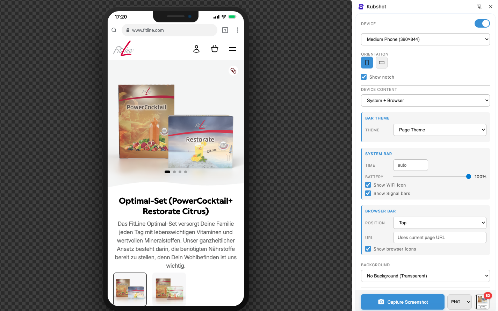

# Kubshot

A free simple Chrome extension for capturing website screenshots with device frames. No accounts, no file uploads — everything runs locally in your browser. Open source project.




## Features

- 📱 **Device frames** - Preview any webpage in phones or tablets
- 🖼️ **Realistic bezels** - Clean, trademark-free device frames
- 📐 **Custom dimensions** - Define your own screen size for any device
- 🎛️ **System bar customization** - Configure time, battery level, WiFi and signal icons
- 🌐 **Browser bar options** - Show/hide browser chrome with custom URL
- 🎨 **Theme control** - Light/dark/custom colors for system and browser bars
- 📸 **Screenshot capture** - Capture the preview with device frame
- 🔳 **Transparent export** - Export with transparent backgrounds for compositing
- 📋 **Clipboard copy** - One-click copy to clipboard
- 💾 **Multi-format export** - Download as PNG, WebP, or JPEG
- 🎨 **Background presets** - Solid colors and gradients for presentation
- 📐 **3D tilt effects** - Perspective transforms with visual gizmo control
- 🔄 **Orientation toggle** - Switch between portrait and landscape
- �️ **Screenshot gallery** - All captures saved locally with download and copy options

## Installation

### From Source (Developer Mode)

1. Clone this repository:
   ```bash
   git clone https://github.com/kubocob/kubshot.git
   cd kubshot
   ```

2. Open Chrome and navigate to `chrome://extensions`

3. Enable **Developer mode** (toggle in top-right corner)

4. Click **Load unpacked** and select the `src` folder

5. The extension icon should appear in your toolbar

## Usage

1. Click the Kubshot extension icon to open the side panel
2. Toggle **Enable Preview** to activate the overlay
3. Select a device type and preset from the dropdowns
4. Choose orientation, background, and tilt effects as desired
5. Click the capture button to take a screenshot
6. Access your screenshots from the gallery

## Core Principles

- **Fully local** – No backend, no uploads, no tracking
- **Open source** – MIT licensed, fork and modify freely
- **Data-driven** – Device definitions are configurable JSON
- **Developer-first** – Built for devs and basic marketing activity
- **Minimal but extensible** – Start simple

## Non-Goals

- No SaaS features or paid tiers
- No account system
- No OEM trademark usage (generic bezels only)
- No advanced emulation (network throttling, CPU, sensors)
- Not a responsive design emulator

## Built With AI

This project was primarily vibe-coded using AI assistance, with occasional manual corrections and guidance.

## Privacy

Kubshot is fully local — no data collection, no accounts, no tracking. See [PRIVACY.md](PRIVACY.md) for details.

## License

MIT License - see [LICENSE](LICENSE) for details.
